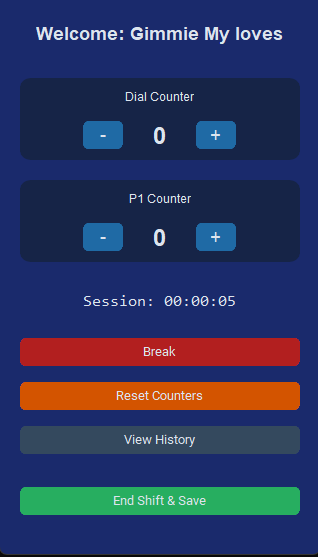
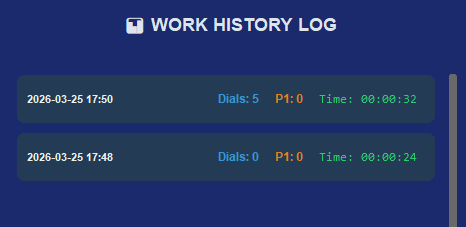

# 🪄 Magica Dial App (v1.0)
<table align="center">
  <tr>
    <td align="center">
      <b>Main Dashboard</b><br>
      
    </td>
    <td align="center">
      <b>Work History Log</b><br>
      
    </td>
  </tr>
</table>
**A minimalist, high-efficiency productivity tracker for high-volume workflows.**

Magica Dial App is a lightweight Python utility designed to stay "Always on Top" of your workspace. It helps users track real-time dial counts, P1 tasks, and session durations without the need to switch windows or break focus.

---

## ✨ Key Features

- **🎯 Dual Counter System:** Independent tracking for "Dials" and "P1" counts with quick-access `+` and `-` controls.
- **⏸️ Break Management:** Dedicated Break button with confirmation dialog to pause your session timer accurately.
- **🕒 Real-time Session Tracking:** Automatic timer that calculates active work hours vs. break time.
- **📊 Visual History Log:** A card-based UI that displays previous shifts, counts, and durations stored in a local SQLite database.
- **🏢 Floating UI:** Built with `CustomTkinter`, the app is configured to remain on top of other applications for maximum visibility.
- **🧹 Reset Function:** Quickly clear your current session counters for a fresh start.

---

## 🚀 Getting Started

### Prerequisites
- Python 3.8 or higher
- `customtkinter` library

### Installation
1. **Clone the repository:**
   ```bash
   git clone [https://github.com/YOUR_USERNAME/Magica_dial_app.git](https://github.com/YOUR_USERNAME/Magica_dial_app.git)
   cd Magica_dial_app# 🪄 Magica Dial App (v1.0)
**A minimalist, high-efficiency productivity tracker for high-volume workflows.**

Magica Dial App is a lightweight Python utility designed to stay "Always on Top" of your workspace. It helps users track real-time dial counts, P1 tasks, and session durations without the need to switch windows or break focus.

---

## ✨ Key Features

- **🎯 Dual Counter System:** Independent tracking for "Dials" and "P1" counts with quick-access `+` and `-` controls.
- **⏸️ Break Management:** Dedicated Break button with confirmation dialog to pause your session timer accurately.
- **🕒 Real-time Session Tracking:** Automatic timer that calculates active work hours vs. break time.
- **📊 Visual History Log:** A card-based UI that displays previous shifts, counts, and durations stored in a local SQLite database.
- **🏢 Floating UI:** Built with `CustomTkinter`, the app is configured to remain on top of other applications for maximum visibility.
- **🧹 Reset Function:** Quickly clear your current session counters for a fresh start.

---

## 🚀 Getting Started

### Prerequisites
- Python 3.8 or higher
- `customtkinter` library

### Installation
1. **Clone the repository:**
   ```bash
   git clone [https://github.com/YOUR_USERNAME/Magica_dial_app.git](https://github.com/YOUR_USERNAME/Magica_dial_app.git)
   cd Magica_dial_app
2. **Install dependencies:** 
    ```bash
    pip install -r requirements.txt
3. **Run the application**
    ```bash
    python main.py

### 🛠️ Building the Executable
If you want to use this as a standalone Windows application:

1. **Install PyInstaller:**
    ```bash
    pip install pyinstaller
2. **Run the build command**
    ```bash
    python -m PyInstaller --noconsole --onefile --clean --collect-all customtkinter main.py
3. **Find your app in the dist/ folder.**

### 📂 Data Storage
The app uses a local SQLite database (work_data.db).
- **Portability:** To move your history to a new computer, simply copy the .db file into the same folder as the executable on the new machine.
- **Privacy:** Your data is stored locally on your machine and is never uploaded to a cloud service.

### 📜 License
This project is licensed under the MIT License.